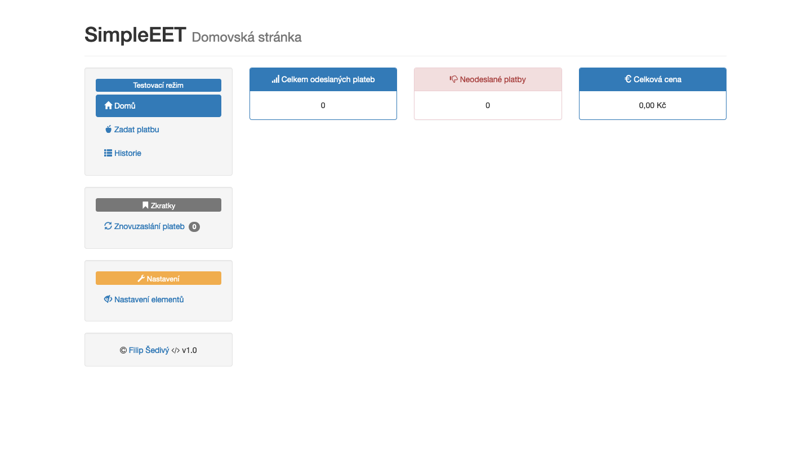

# SimpleEET

SimpleEET je ukázkový projekt, kde je ukázána možnost vytvoření jednoduchého rozhraní pro
zasílání EET plateb, dále i pro storna a znovuzaslání.

# Instalace
```
$ wget https://github.com/filipsedivy/SimpleEET/archive/master.zip
$ unzip SimpleEET-master.zip
$ cd SimpleEET-master/
$ composer install
```

